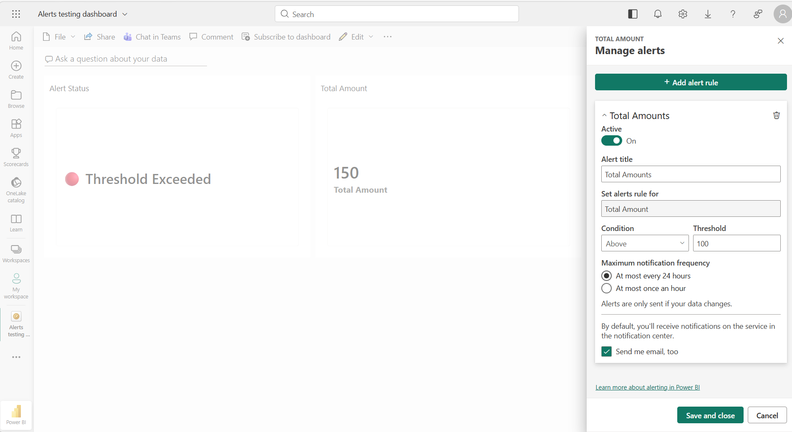
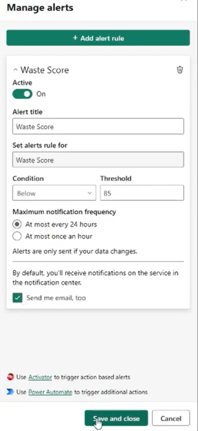
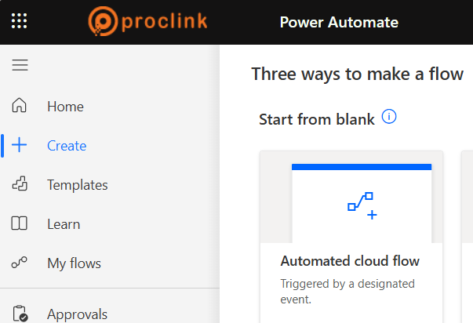
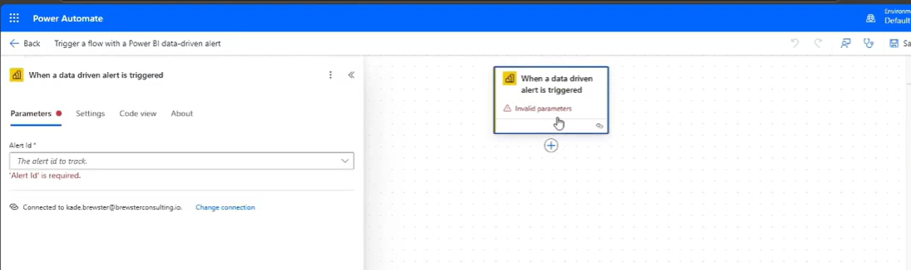
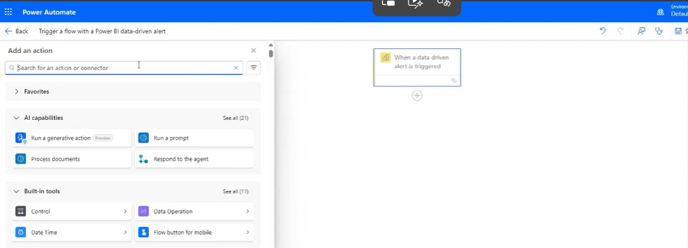
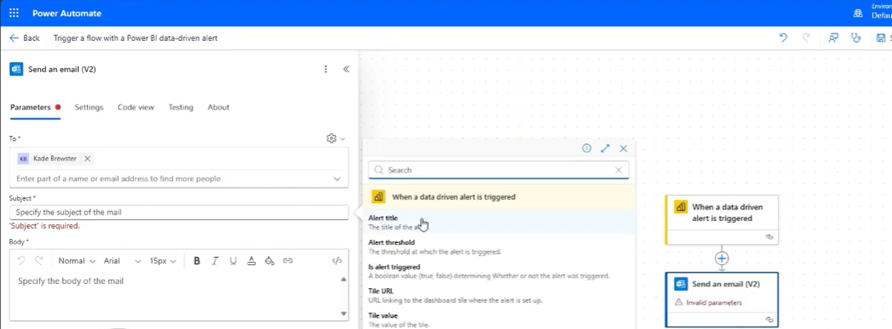

# Power BI Alerts Automation — Design & Implementation Document

**Document:** Exploring Automated Alerts — Power BI Alerts Automation Flow
**Prepared:** July 2026

---

## 1. Executive Summary

This document describes an end-to-end automated alerting solution built on **Power BI**, **Azure SQL Database**, and **Power Automate**. The solution continuously monitors key business metrics (for example, Total Amount, Waste Score, Refinery Utilization, and Open Tickets) on Power BI dashboards. When a metric crosses a predefined threshold, a data-driven alert fires in Power BI and automatically triggers a Power Automate cloud flow. The flow enriches the alert with recipient and message details stored in a centralized Azure SQL configuration table (`AlertEmailConfig`), composes a dynamic email that includes the live metric value and threshold, and delivers it to the right business stakeholders through Office 365 Outlook.

Key benefits of this solution:

- **Proactive monitoring** — stakeholders are notified within minutes of a threshold breach instead of discovering it during manual dashboard reviews.
- **Centralized, no-code configuration** — recipients, subjects, and email bodies are maintained in a single SQL table; adding or changing recipients requires a data update, not a flow redesign.
- **Dynamic, context-rich notifications** — every email carries the current tile value, the alert threshold, and the alert name pulled directly from the Power BI trigger output.
- **Scalable and reusable** — the same flow pattern supports any number of alerts across workspaces by adding rows to the configuration table and reusing the trigger.

**Prerequisite:** the user configuring alerts must hold a **Power BI Pro license** to set alerts and send notifications.

---

## 2. Introduction

Power BI dashboards allow users to pin visuals (cards, KPIs, and gauges) as tiles and attach **data-driven alerts** to them. Natively, these alerts only notify the dashboard owner through the Power BI notification center and an optional email to that same owner. In real business scenarios, however, the people who must act on a breach — operations managers, support leads, plant supervisors — are rarely the report owner, and the standard alert email cannot be customized.

This document explains how to extend Power BI's native alerting with **Power Automate** and **Azure SQL** to overcome those limitations. The automation flow described here:

1. Listens for the Power BI **"When a data driven alert is triggered"** event.
2. Looks up the distribution list and message template for that alert from an Azure SQL table.
3. Builds a dynamic email body that embeds the current metric value and threshold.
4. Sends a formatted (HTML) email to the configured To and CC recipients via Office 365 Outlook.

The remainder of this document covers the business requirement, the step-by-step implementation, and a description of each screenshot captured during the build.

---

## 3. Business Requirement

The business needs timely, targeted notifications whenever critical operational metrics breach their acceptable limits. Specific requirements:

| # | Requirement |
|---|-------------|
| 1 | Monitor dashboard KPIs (e.g., Total Amount, Waste Score, Refinery Utilization, Open Tickets) against defined thresholds. |
| 2 | Notify the correct business users (To and CC lists) automatically when a threshold is crossed — not just the report owner. |
| 3 | Allow alert recipients, subject lines, and email bodies to be maintained centrally without modifying the flow (configuration-driven design). |
| 4 | Include the live metric value and the threshold in the notification so recipients can gauge severity without opening the dashboard. |
| 5 | Support both "above threshold" conditions (e.g., Total Amount above 100) and "below threshold" conditions (e.g., Waste Score below 85). |
| 6 | Control notification frequency (at most once every 24 hours or once an hour) to avoid alert fatigue. |
| 7 | Deliver notifications as HTML email through the corporate Office 365 Outlook service. |

**Example configuration record:**

| AlertName | ToEmail | CCEmail | Subject | EmailBody |
|-----------|---------|---------|---------|-----------|
| Refinery Utilization Alert | abc@company.com | manager@company.com | Refinery Utilization Exceeded Threshold | Refinery Utilization exceeded threshold limit |

**Licensing prerequisite:** a Power BI Pro license is required to create alerts and send notifications.

---

## 4. Power BI Implementation

The solution is implemented in ten steps spanning Power BI, Azure SQL, and Power Automate.

### Step 1: Create Alert in Power BI

Pin the metric visual (a card tile such as **Total Amount**) to a Power BI dashboard, open the tile's **Manage alerts** pane, and click **Add alert rule**. Configure:

- **Alert title** — e.g., *Total Amounts* or *Waste Score*.
- **Condition and Threshold** — e.g., *Above 100* for Total Amount, *Below 85* for Waste Score.
- **Maximum notification frequency** — at most every 24 hours, or at most once an hour.
- **Send me email, too** — optional native email to the owner.

Save the rule with **Save and close**. The pane also surfaces the two extension points used later: *Use Activator to trigger action based alerts* and *Use Power Automate to trigger additional actions*.

### Step 2: Create Azure SQL Email Configuration Table

Create a configuration table in Azure SQL Database to hold the recipients and message template for each alert:

```sql
CREATE TABLE AlertEmailConfig
(
    AlertID INT IDENTITY(1,1),
    AlertName VARCHAR(100),
    ToEmail VARCHAR(MAX),
    CCEmail VARCHAR(MAX),
    Subject VARCHAR(500),
    EmailBody VARCHAR(MAX)
)
```

Populate one row per alert (see the example record in Section 3).

### Step 3: Create Power Automate Flow

Navigate to **Power Automate → Create → Automated cloud flow**. An automated cloud flow is *"triggered by a designated event"* — in this case, the Power BI alert.

### Step 4: Configure Trigger

Select the trigger **"When a data driven alert is triggered"** (Power BI connector). Configure its parameters:

- **Workspace** — the workspace hosting the dashboard (e.g., *Production*).
- **Alert (Alert Id)** — the alert rule to track (e.g., *Open Ticket Alert*).

The trigger shows *Invalid parameters* until a valid Alert Id is chosen, and it runs under a connected Power BI account.

### Step 5: Read Data from Azure SQL

Add the action **SQL Server → Get rows (V2)** using an **Azure SQL Database** connection, filtered to the current alert:

```sql
SELECT *
FROM AlertEmailConfig
WHERE AlertName = 'Ticket Alert'
```

**Alternative:** encapsulate the lookup in a stored procedure and call it instead:

```sql
EXEC usp_GetAlertEmailDetails
```

### Step 6: Parse SQL Result

The SQL action returns the configuration for the alert as JSON, which downstream actions consume:

```json
{
  "ToEmail":  "abc@company.com",
  "CCEmail":  "manager@company.com",
  "Subject":  "Open Tickets Crossed Threshold",
  "EmailBody":"Open tickets exceeded threshold limit"
}
```

### Step 7: Capture Current Power BI Value

The trigger output exposes the live alert context: **Tile Value**, **Threshold**, **Alert Name**, and **Time Triggered**. The most useful dynamic content fields are:

- `alertTitle`
- `alertThreshold`
- `tileValue`

Example at trigger time: *Current Value = 145, Threshold = 100.*

### Step 8: Build Dynamic Email Body

Compose the email body from the SQL template plus the live metric value appended from dynamic content. Example:

```text
Hello Team,

Alert has been triggered.
Please review immediately.

Regards,
Power BI Monitoring System
```

### Step 9: Send Email

Add the action **Office 365 Outlook → Send an email (V2)** and map the fields:

| Email field | Mapped value |
|-------------|--------------|
| To | `ToEmail` (from SQL) |
| CC | `CCEmail` (from SQL) |
| Subject | `Subject` (from SQL) |
| Body | `EmailBody` + Current Metric Value (dynamic content) |

Enable **Is HTML = Yes** so the body renders as formatted HTML.

### Step 10: Complete Flow

The finished flow chains the four building blocks:

```text
Trigger: When a data driven alert is triggered
        │
        ▼
Get Rows from Azure SQL
        │
        ▼
Compose Dynamic Email
        │
        ▼
Send Email (V2)
```

**Optional extended configuration table** — for richer governance (thresholds, activation flags, auditing), the configuration table can be extended:

```sql
CREATE TABLE AlertConfiguration
(
    AlertID INT IDENTITY,
    AlertName VARCHAR(100),
    ThresholdValue INT,
    ToEmail VARCHAR(MAX),
    CCEmail VARCHAR(MAX),
    Subject VARCHAR(500),
    EmailBody VARCHAR(MAX),
    IsActive BIT,
    CreatedDate DATETIME
)
```

**Prerequisite reminder:** the user must have a Power BI Pro license to set alerts and send notifications.

---

## 5. Screenshot Descriptions

### Screenshot 1 — Power BI dashboard with "Manage alerts" pane (Total Amounts alert)



This screenshot shows the **Alerts testing dashboard** in the Power BI service. The canvas contains two tiles: an **Alert Status** card displaying *"Threshold Exceeded"* (with a red status indicator) and a **Total Amount** card showing the value **150**. On the right, the **Manage alerts** pane is open for the Total Amount tile. An alert rule named **"Total Amounts"** is configured with the toggle **Active = On**, **Set alerts rule for = Total Amount**, **Condition = Above**, and **Threshold = 100**. The **Maximum notification frequency** is set to *"At most every 24 hours"* (with *"At most once an hour"* as the alternative), the note *"Alerts are only sent if your data changes"* is displayed, and the **"Send me email, too"** checkbox is ticked. The **Save and close** button commits the rule. Since the current value (150) is above the threshold (100), this alert is in a breached state — matching the "Threshold Exceeded" status card.

### Screenshot 2 — "Manage alerts" pane (Waste Score alert, below-threshold condition)



This screenshot shows the **Manage alerts** pane for a second alert rule named **"Waste Score"**. The rule is **Active = On**, targets the *Waste Score* tile, and demonstrates the opposite comparison direction: **Condition = Below** with **Threshold = 85**, so the alert fires when the score drops under 85. Notification frequency is *"At most every 24 hours"* and *"Send me email, too"* is checked. At the bottom of the pane, two extension links are visible — *"Use **Activator** to trigger action based alerts"* and *"Use **Power Automate** to trigger additional actions"* — the second of which is the integration path this solution uses. The **Save and close** button is being clicked to save the rule.

### Screenshot 3 — Power Automate "Create" page (Automated cloud flow)



This screenshot shows the **Power Automate** portal (Proclink-branded environment) with the left navigation menu (Home, **Create**, Templates, Learn, My flows, Approvals). The **Create** page is open on the *"Three ways to make a flow"* section under **Start from blank**, highlighting the **Automated cloud flow** tile with its caption *"Triggered by a designated event."* This is the flow type selected for the solution, because it must start automatically whenever the Power BI data-driven alert fires (Step 3).

### Screenshot 4 — Flow trigger configuration ("When a data driven alert is triggered")



This screenshot shows the Power Automate flow designer for the flow *"Trigger a flow with a Power BI data-driven alert."* The trigger card **"When a data driven alert is triggered"** is selected on the canvas and flagged with an *"Invalid parameters"* warning because configuration is incomplete. The left configuration panel shows the **Parameters** tab (alongside Settings, Code view, and About) with the required **Alert Id** dropdown (*"The alert id to track"*) and the validation message *"'Alert Id' is required."* The panel also shows the active Power BI connection (*Connected to kade.brewster@brewsterconsulting.io*) with a **Change connection** link. This corresponds to Step 4 — selecting the workspace and the specific alert the flow should listen to.

### Screenshot 5 — "Add an action" panel (searching for the SQL action)



This screenshot shows the flow designer immediately after the trigger, with the **Add an action** panel open on the left. The panel provides a search box (*"Search for an action or connector"*) and lists connector categories: **AI capabilities** (Run a generative action, Run a prompt, Process documents, Respond to the agent) and **Built-in tools** (Control, Data Operation, Date Time, Flow button for mobile). On the canvas, the **"When a data driven alert is triggered"** trigger card is in place with a **+** button beneath it where the new action will be inserted. This is the entry point for Step 5, where the **SQL Server → Get rows (V2)** action is searched for and added to read the `AlertEmailConfig` table.

### Screenshot 6 — "Send an email (V2)" action with Power BI dynamic content



This screenshot shows the configuration of the **Send an email (V2)** (Office 365 Outlook) action — the final step of the flow. The left panel shows its **Parameters** tab with the **To** field populated (recipient *Kade Brewster*), the required **Subject** field (*"'Subject' is required"* validation visible), and the rich-text **Body** editor with formatting controls. In the center, the **dynamic content picker** is open and lists the outputs of the *"When a data driven alert is triggered"* trigger: **Alert title** (the title of the alert), **Alert threshold** (the threshold at which the alert is triggered), **Is alert triggered** (a boolean indicating whether the alert fired), **Tile URL** (link to the dashboard tile where the alert is set up), and **Tile value** (the value of the tile). These fields are inserted into the subject/body to build the dynamic message (Steps 7–9). On the right, the flow canvas shows the completed sequence: the trigger card connected to the **Send an email (V2)** card.

---

*End of document.*
